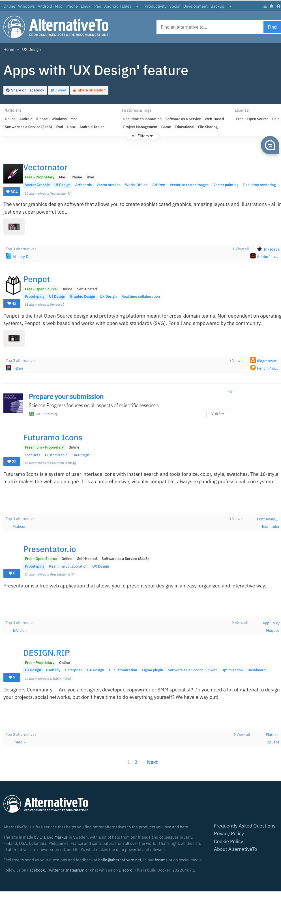
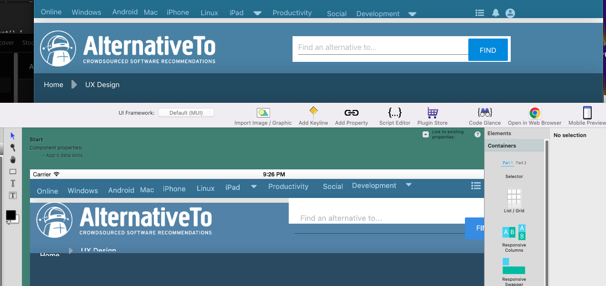

# AlternativeTo 'UX Design' feature clone

This is an open-source clone of https://alternativeto.net/feature/ux-design/ to demonstrate best practices for using [React Studio](https://reactstudio.com/).

**Here is a screenshot of how it should look:**

**Here is what it looks like so far:**

